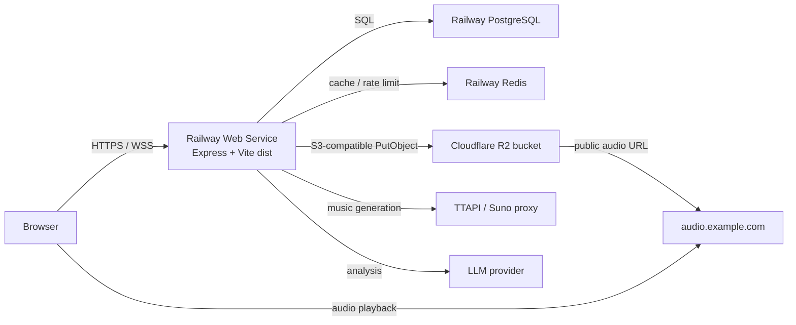

# Railway + Cloudflare R2 部署方案

更新时间：2026-07-04

## 目标

将当前项目部署为一个公网可访问的生产服务：

- Railway 运行 Node/Express、Vite 静态产物、API、WebSocket、PostgreSQL、Redis。
- Cloudflare R2 保存生成后的音频文件，避免 TTAPI CDN URL 过期和 Railway 容器本地文件丢失。
- 前端和 API 同域部署，浏览器直接访问 Railway 域名或自定义域名。

## 推荐拓扑



生产环境建议先保持 1 个 Railway Web 副本。当前编排事件已通过 Redis Pub/Sub 跨实例广播，但编排运行态仍会在进程内重建；正式横向扩容前应继续做长时会话压测。

## 当前仓库适配情况

- `npm run build` 构建 Vite 前端到 `dist/`。
- `NODE_ENV=production npm start` 启动 `server/index.js`，同一端口服务 API、WebSocket 和前端静态文件。
- `/api/health` 已可作为 Railway healthcheck。
- `server/storage/index.js` 已支持 `STORAGE_DRIVER=r2`，底层使用 `@aws-sdk/client-s3`。
- `server/db/index.js` 已支持 `DB_DRIVER=pg` 和 `DATABASE_URL`。
- `server/cache/index.js` 已支持 `REDIS_URL`，未配置时降级内存缓存。

已做上线适配：

- 生产环境默认监听 `0.0.0.0`；如果 Railway 上误设 `HOST=127.0.0.1`，服务会忽略该 loopback 配置并改用 `0.0.0.0`。
- 后台 runtime config 已持久化到数据库，并会在首次启动时从旧的 `server/data/runtime-config.json` 导入。
- 生产环境中，`KEY` / `TOKEN` / `SECRET` 类密钥如果已在 Railway Variables 设置，后台数据库配置不会覆盖它。
- 兜底曲库已持久化到数据库，并会在首次启动时从默认 manifest 或旧的 `server/data/runtime-library.json` 导入。
- WebSocket 前端已增加断线自动重连。
- 编排事件已增加 Redis Pub/Sub 跨实例广播。

仍需部署时注意：

- 不要在 Railway 手动设置固定 `PORT=3001`，让 Railway 注入 `PORT`。
- 生产密钥优先放 Railway Variables；代码会把已存在的环境变量密钥视为锁定值，后台页面保存同名密钥不会覆盖线上实际使用值。

## Railway 配置

### 服务组成

在 Railway 创建一个 Project，添加：

- Web Service：连接本 GitHub 仓库。
- PostgreSQL：保存用户、曲库、生成任务、播放历史。
- Redis：保存限流、任务状态缓存；后续多实例也可作为 Pub/Sub 基础。

Web Service 配置：

| 项目 | 值 |
| --- | --- |
| Builder | Railway 默认 Node builder |
| Build Command | `npm run build` |
| Start Command | `npm start` |
| Healthcheck Path | `/api/health` |
| Public Networking | 先生成 Railway 域名，正式环境再绑定自定义域名 |
| Replicas | 先设为 `1` |

Railway 会自动注入 `PORT`，不要手动设置固定端口。

### 环境变量

Web Service 设置：

| 变量 | 生产值 | 说明 |
| --- | --- | --- |
| `NODE_ENV` | `production` | 必须，否则 Express 不会服务 `dist/` |
| `HOST` | `0.0.0.0` | Railway 公网代理必须能连到服务 |
| `DB_DRIVER` | `pg` | 使用 Railway PostgreSQL |
| `DATABASE_URL` | `${{Postgres.DATABASE_URL}}` | Railway Reference Variable |
| `REDIS_URL` | `${{Redis.REDIS_URL}}` | Railway Reference Variable |
| `ADMIN_TOKEN` | 随机高强度 token | 公网后台必须设置 |
| `APP_ORIGIN` | `https://app.example.com` | 自定义域名上线后填写 |
| `CORS_ORIGINS` | `https://app.example.com` | 单服务同域可留空；多域访问时填写 |
| `STORAGE_DRIVER` | `r2` | 生产音频必须进 R2 |
| `S3_ENDPOINT` | `https://<ACCOUNT_ID>.r2.cloudflarestorage.com` | R2 S3 API endpoint |
| `S3_REGION` | `auto` | R2 region |
| `S3_BUCKET` | `vibe-audio-prod` | 生产桶名 |
| `S3_ACCESS_KEY` | R2 Access Key ID | 只授予目标桶读写 |
| `S3_SECRET_KEY` | R2 Secret Access Key | 只在创建 token 时可见 |
| `S3_PUBLIC_URL` | `https://audio.example.com` | R2 自定义域名，末尾不要 `/` |
| `TTAPI_KEY` | 生产 TTAPI key | 未配置会走兜底模式 |
| `TTAPI_BASE_URL` | `https://api.ttapi.io` | 默认即可 |
| `TTAPI_SUNO_MV` | 当前可用模型 | 按 TTAPI 实际支持调整 |
| `USE_FALLBACK_ONLY` | `false` | 彩排可临时改 `true` |
| `LLM_PROVIDER` | `openai` 或其他 | 与下方 key 对应 |
| `OPENAI_API_KEY` 等 | 对应供应商 key | 只配置实际使用的供应商 |
| `MUSIC_GENERATE_RATE_LIMIT` | `5` 到 `10` | 每 IP 每分钟生成限流 |
| `QUOTA_PER_DAY` | 按预算设置 | 每用户日生成额度 |
| `GLOBAL_DAILY_LIMIT` | 按预算设置 | 全站日生成额度 |

可选变量：

- `AUDIO_PROXY_ALLOWED_HOSTS=audio.example.com`：如果需要让 `/api/music/proxy` 代理非用户生成、非曲库登记的 R2 音频 URL，再启用。
- `AUDIO_PROXY_MAX_BYTES`：默认 50 MB，音频更大时提高。
- `LLM_CLI_TIMEOUT_MS`：Railway 不建议依赖本地 CLI provider；生产优先使用 HTTP API provider。

密钥优先级：

- 生产环境中，变量名包含 `KEY`、`TOKEN` 或 `SECRET` 的配置，如果 Railway Variables 中存在非空值，则始终使用 Railway Variables。
- 后台 API 配置可作为开发环境或临时 fallback；正式 production 不应把后台数据库配置当作密钥 source of truth。
- `/api/config/keys` 会返回 `source` 和 `locked` 字段；`locked=true` 表示该密钥由环境变量锁定。

## Cloudflare R2 配置

### 桶与凭据

1. 在 Cloudflare Dashboard 创建 R2 bucket，例如 `vibe-audio-prod`。
2. 创建 R2 S3 API token，权限选择 Object Read & Write，并限制到该 bucket。
3. 保存 Access Key ID、Secret Access Key 和 endpoint。

Railway 对应变量：

```text
S3_ENDPOINT=https://<ACCOUNT_ID>.r2.cloudflarestorage.com
S3_REGION=auto
S3_BUCKET=vibe-audio-prod
S3_ACCESS_KEY=<R2 Access Key ID>
S3_SECRET_KEY=<R2 Secret Access Key>
```

当前代码写入对象路径：

```text
audio/<jobId>.mp3
arranger/<sessionId>/<trackId>-<suffix>.mp3
```

### 公开访问域名

当前代码会把 `S3_PUBLIC_URL` 写入数据库并直接返回给播放器，所以生产方案使用 R2 自定义域名：

1. 确保主域名在同一个 Cloudflare account 下。
2. 在 R2 bucket 的 Settings -> Custom Domains 添加 `audio.example.com`。
3. 等状态变为 Active。
4. 设置 Railway 变量 `S3_PUBLIC_URL=https://audio.example.com`。

不要把 `r2.dev` 当生产域名使用；它适合开发验证，生产应使用自定义域名。

### 缓存策略

代码上传对象时已设置：

```text
Cache-Control: public, max-age=31536000, immutable
Content-Disposition: inline
```

因为音频 key 包含 job/session 随机 ID，内容可视为不可变，适合长期缓存。若后续允许覆盖同 key 文件，需要取消 `immutable` 或改成版本化 key。

## 部署流程

### 1. 本地预检

```bash
npm ci
npm test
npm run build
NODE_ENV=production HOST=0.0.0.0 PORT=3001 npm start
```

另开终端检查：

```bash
curl http://127.0.0.1:3001/api/health
```

### 2. Staging 环境

先在 Railway 使用 staging 环境跑通：

- Railway Web Service 绑定仓库。
- 添加 Postgres、Redis。
- 使用独立的 `vibe-audio-staging` R2 bucket 和独立 token。
- `USE_FALLBACK_ONLY=true` 先验证页面、登录、播放兜底曲。
- 再设置 `TTAPI_KEY`，验证真实生成和 R2 落盘。

### 3. Production 环境

1. 在 Railway production 环境设置完整变量。
2. 部署 Web Service。
3. 观察 build logs 和 deploy logs。
4. Healthcheck `/api/health` 返回 200 后，打开 Railway public domain。
5. 绑定自定义域名 `app.example.com`。
6. 更新 `APP_ORIGIN` 和 `CORS_ORIGINS` 为正式域名。

数据库迁移当前在服务启动时自动执行 `CREATE TABLE IF NOT EXISTS ...`。未来如果引入破坏性迁移，需要改成显式 migration step，并在部署前做 Postgres snapshot。

## 验证清单

基础验证：

```bash
curl https://app.example.com/api/health
```

应确认：

- 页面可加载，静态资源无 404。
- 注册、登录、登出正常，生产 Cookie 通过 HTTPS 生效。
- `/#/admin` 输入 `ADMIN_TOKEN` 后可查看配置状态。
- Prompt preview 可用。
- 真实生成任务完成后，数据库 `generation_jobs.audio_local` 有 `https://audio.example.com/...`。
- R2 bucket 出现 `audio/*.mp3` 或 `arranger/**/*.mp3`。
- 刷新页面后历史曲目仍可播放。
- `/ws/events` 在编排页可连接并收到事件。

音频验证：

```bash
curl -I https://audio.example.com/audio/<jobId>.mp3
```

期望：

- HTTP 200。
- `Content-Type` 是音频类型。
- 有长期缓存头。
- 浏览器 Network 面板播放时没有 CORS 或 403 问题。

## 回滚方案

- 应用回滚：Railway Deployments 里回滚到上一个成功部署。
- 变量回滚：Railway Variables 改回上一版，重新部署或重启服务。
- R2 回滚：对象 key 是追加式，通常无需回滚；误删对象需从备份或重新生成恢复。
- 数据库回滚：当前迁移只有建表，风险较低；正式引入结构变更前要先做 Railway Postgres snapshot。

## 上线前风险状态

| 风险 | 状态 | 处理 |
| --- | --- | --- |
| `HOST` 默认 `127.0.0.1` | 已处理 | 生产默认 `0.0.0.0`，Railway loopback HOST 会被忽略 |
| 生产密钥被后台配置覆盖 | 已处理 | `KEY`/`TOKEN`/`SECRET` 类密钥在 production 中优先 Railway Variables，环境变量存在时后台值不会覆盖 |
| 本地 runtime config/library 文件 | 已处理 | runtime config 和 fallback tracks 已迁到 DB，旧 JSON 只作为首次导入源 |
| WebSocket 前端无显式重连 | 已处理 | 前端指数退避重连，重连后刷新池状态和历史 |
| 多副本进程内事件总线 | 部分处理 | 编排事件已走 Redis Pub/Sub；正式多副本前仍需长时会话压测 |
| 启动时自动迁移 | 接受现状 | 当前迁移只新增/创建表；未来破坏性迁移再引入 pre-deploy migration |
| R2 public bucket | 产品取舍 | 当前播放器需要公开音频 URL；若曲目需要私有化，再改签名 URL 或后端鉴权代理 |

## 官方参考

- Railway: https://docs.railway.com/networking/troubleshooting/application-failed-to-respond
- Railway: https://docs.railway.com/deployments/healthchecks
- Railway: https://docs.railway.com/guides/fullstack-nextjs
- Railway: https://docs.railway.com/guides/socketio
- Cloudflare R2: https://developers.cloudflare.com/r2/get-started/s3/
- Cloudflare R2: https://developers.cloudflare.com/r2/api/tokens/
- Cloudflare R2: https://developers.cloudflare.com/r2/api/s3/api/
- Cloudflare R2: https://developers.cloudflare.com/r2/buckets/public-buckets/
